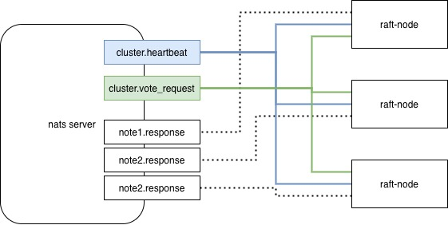

# graft-example

通过示例分解graft底层代码。

## 运行环境

graft运行环境如下，

- nats server：单点。运行在localhost:4222。其中topic有3个，分别是：
  - vote_request：发起投票
  - vote_response：响应投票
  - heartbeat：发送心跳

- graft-example：集群数量为3，RPC通过nats server相互通信，通信协议为protobuf。

**架构**

节点起来后，会与nats server建立初始化连接。具体的消息队列topic说明如下：

1. **cluster.heartbeat：**
   - 集群所有节点都订阅相同的topic，例如：graft.cluster.vote_request。
   - 订阅该topic：接收集群中其他的节点的心跳。
   - 向该topic发送心跳消息

2. **vote_request：**
   - 集群所有节点都订阅相同的topic，例如：graft.cluster.vote_request。
   - 订阅该topic：接收其他节点发出的投票。
   - 向该topic发送投票消息

3. **node.response**
   - 各个节点订阅各自的response topic：接收投票响应

## raft流程介绍

本节描述raft协议的大体流程介绍。

### 初始化

本节描述集群启动后的状态变化过程：

*以Node1为例，描述获得Leader角色的状态变化*

1. Node1启动后，先以Follower角色启动。
2. 此时，节点中没有Leader节点，也即没有收到Heartbeat消息，则会触发Term Timeout，转换为Candidate角色。
3. 向集群其他节点发送选举投票消息。
4. 接收到其他节点确认投票消息后，达到(N/2 + 1)选票数后，则标志为自己为Leader节点。
5. Node1节点作为Leader节点，向集群中其他节点发送心跳消息来维持集群中的Leader角色。

### 新节点加入

本节描述集群运转过程中，此时若有新节点加入。

*以Node2为例，描述新节点加入后的状态变化*

1. Node2启动后，先以Follower角色启动。
2. 此时，集群中由于有Node1作为Leader节点在发送Heartbeat消息，则Node2会接收到Heartbeat的消息。
3. Node2设置Node1为Leader节点，并设置状态为当前集群的状态。（term、log index等等）

## graft代码分析

本节描述graft源码中，详细的代码分析。

**初始化 - 以Follower状态启动**

假设集群刚被初始化，当前没有任何节点处于Leader节点状态，也即没有收到任何节点的心跳信息。

1. 节点启动后，状态为Follower。
2. 由于当前集群没有Leader，导致当前term的选举超时（election timeout），节点转换为Candidate，同时更新term为term+1。各个节点的超时时间是随机超时时间，假设此时Node1首先超时。

我们将列举Node1获得leader状态的过程：

1. 向集群中发起投票。
   - 投票给自己
   - 通过nats server的cluster.vote_request队列中发出投票。

2. 根据投票结果，进行不同的状态转换，
   - 赢得多数投票：将当前节点更新为Leader节点。
   - 未赢得多数投票。下列详细分析：

发起投票后，在等待投票结果的过程中，会出现下列的情况，

a. 当前选举周期超时，即没有节点获取到多数投票。此时重置状态，重新进行投票选举。

b. 从node1.response中获取其他节点的响应：
   1. 判断response是否有效：是否投票给自己；是否是当前的term投票。
   2. 若response有效，则选票计数+1。
   3. 若获得多数选票，则切换为Leader节点。
   4. 否则，继续等待其他节点的投票结果。

c. 从cluster.vote_request中获取其他节点的投票请求：
   1. 如果发起投票的请求term落后于node1的term，则发送拒绝response；
   2. 如果对于当前term，node1已经投票给其他节点，则发送拒绝response；
   3. 如果node1接收到的其他节点的request中的term大于node1的term，则更新term到更新的term，并重置当前term的信息，包括：投票信息和leader信息。
   4. 如果node1已经是leader，则直接返回拒绝票。
   5. 否则，上述都没有触发。则投票给请求者。

d. 从cluster.heartbeat中获取集群中的心跳信息：
   1. 如果当前节点还没有设定Leader，则设置心跳信息中的Leader为当前节点的Leader。
   2. 如果当前节点已经有设定Leader，则需要根据term的比对进行处理：
      - 当前term > 心跳term，则忽略心跳请求。
      - 心跳term > 当前term，则更新term到心跳term，且重置投票状态，并且更新当前节点的Leader为心跳节点的Leader。
      - 心跳term == 当前term，且当前节点为Leader节点，则忽略。
      - 心跳term == 当前term，且当前节点为Candidate状态，则投票给心跳节点的Leader。
